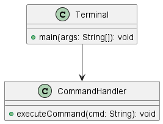

<h1 align="left">Projeto Terminal Java</h1>

### 📌 Sobre o Repositório

<p align="left">Este repositório foi criado para armazenar e gerenciar o projeto proposto na disciplina de Programação Orientada a Objetos (POO). Aqui, serão realizadas todas as atualizações e melhorias necessárias ao longo do desenvolvimento.  👇🏼</p>

### 🎯 Objetivo

<p align="left">O principal propósito deste repositório é facilitar o trabalho em grupo, garantindo um ambiente organizado e colaborativo para o desenvolvimento do projeto.</p>

### 👥 Desenvolvedores

<p align="left">As atualizações e contribuições serão feitas por:</p>
<p>🧑‍💻 Natan Ribeiro Limiro</p>
<p>🧑‍💻 Juracy Neto</p>


## Diagrama De Classes


### Código PlantUML
```plantuml
@startuml
class Terminal {
    +main(String[] args)
}

class CommandHandler {
    +executeCommand(String input)
}

class FileManager {
    +createFile(String nome)
    +deleteFile(String nome)
    +readFile(String nome)
    +writeFile(String nome, String conteudo)
}

class DirectoryManager {
    +changeDirectory(String caminho)
    +createDirectory(String nome)
    +deleteDirectory(String nome)
    +listContents()
}

class HistoryManager {
    +saveCommand(String comando)
    +getHistory()
}

Terminal --> CommandHandler : "Usa"
CommandHandler --> FileManager : "Manipula Arquivos"
CommandHandler --> DirectoryManager : "Manipula Diretórios"
CommandHandler --> HistoryManager : "Gerencia Histórico"

@enduml